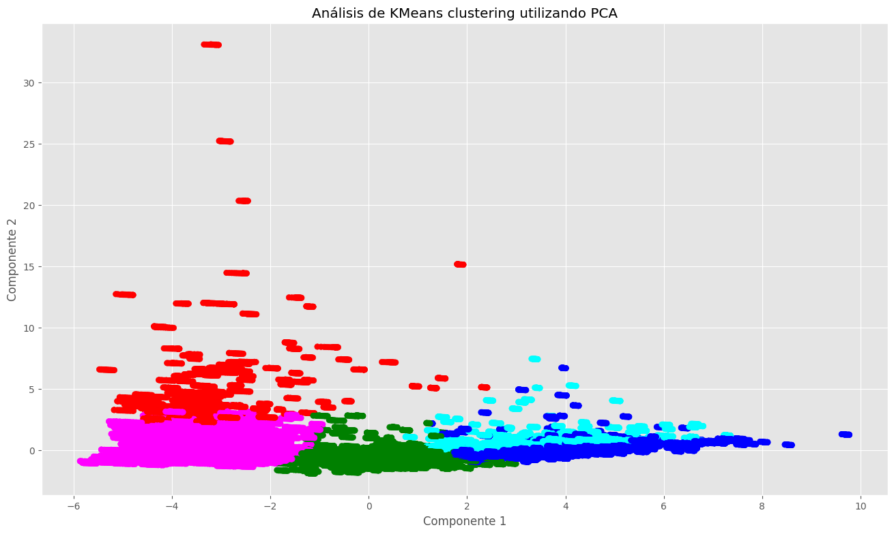

# Predicción de Consumo Energético Empleando Varios Métodos de Aprendizaje Automático.

## Introduccción

Se ha considerado la prevención del consuma de energía como el tema clave para la planeación de red eléctricas inteligentes, en el mercado de electricidad y sustentabilidad de potencia eléctrica [1].  

Este problema se ha planteado a lo largo de diferentes trabajos, en todo el mundo, ya que la predicción del consumo es vital para el manejo de energía. Los motodos empleado se dividen en tres categorías: Análisis Estadístico, Aprendizaje Automático, y aprendizaje profundo (Deep Learning) [1].

La predicción es un requisito esencial para el sistema de generación de energía, no solo para la planeación de inversión de expansión de capacidad, sino también como factor crucial en el manejo de tarifas eléctricas, cual es relevante para el plan de administración de energía [2].

Debido al crecimiento poblacional de las ciudades y al cambio climático provocado por el calentamiento global, se observa un incremento notable en el consumo de energía eléctrica que se incrementa a lo largo de los años. Este fenómeno se debe a una combinación de factores, incluyendo el aumento en la demanda de energía para abastecer a una población en constante expansión y la necesidad de utilizar más sistemas de refrigeración y climatización debido a temperaturas más altas. Esta tendencia representa un desafío significativo para la sostenibilidad energética y destaca la importancia de adoptar medidas de eficiencia energética y de transición hacia fuentes de energía más limpias y renovables.

En este trabajo se empleó el uso de medidas de reducción de dimensionalidad de los datos; así como diversos métodos de entrenamiento no supervisado, y entrenamiento supervisado para explorar diversas formas de producir un modelo que prediga, de la mejor forma posible, el comportamiento variante del consumo de energía a lo largo de los años venideros, específicamente la zona norponiente de México. 

En el caso de la predicción de la demanda de energía, el Manual de Pronósticos que rige las métricas a utilizar por el CENACE, establece que se utilizará la métrica MAPE para medir el grado de certeza con que realiza sus pronósticos de demanda.

Siguiendo lo establecido en el Manual, nuestro modelo deberá igualmente utilizar esta métrica para evaluar su desempeño. Idealmente, se busca un valor del MAPE menor al 5%.

## Trabajos Similiares 
Algunos otros autores se presentan diferentes resultados; Sameh Mahjoub [1] proyecta diversos métodos para predecir el consumo eléctrico de la ciudad de Peroné Francia, como los son Long Short-Term Memory (LSTM), Unidades Recurrentes Cerradas (GRU),  y Drop-GRU.  Este pudo tener un MAPE de alrededor de 10%.

## Datos
Los datos empleados para crear dicho modelo son proporcionados por el Sistema Eléctrico Nacional (SEN), contienen el consumo eléctrico y las temperaturas máximas y mínimas del día en la zona norponiente del país de las siguientes localidades: Caborca, Ciudad Obregón, Hermosillo, en el estado de Sonora, y los Mochis y Culiacán del estado de Sinaloa. También estas cuentan con datos de actividades antropomórficas que se realizan en la zona estudiada, como lo es días feriados, los cuales, afectan directamente al consumo eléctrico debido a que en estos días se reduce significativamente la actividad laboral.

## Análisis de Componentes Principales (PCA)
Para reducir el número de componentes de temperatura en la región del noroeste de México, se empleó el Análisis de Componentes Principales (PCA). Se recolectaron datos históricos de temperatura en diferentes ubicaciones dentro de la región y se organizaron en un conjunto de datos. Luego, se aplicó PCA para encontrar las combinaciones lineales de estas variables que explicaran la mayor parte de la variabilidad en los datos. Mediante la reducción de dimensionalidad, PCA permitió identificar un conjunto más pequeño de componentes principales que representaban efectivamente la información contenida en las múltiples variables originales de temperatura. Esto simplificó la interpretación de los datos y facilitó el análisis posterior de la variabilidad espacial y temporal de la temperatura en la región del noroeste de México, lo que puede ser crucial para comprender y mitigar los efectos del cambio climático y la prediccion de consumo electrico.

Podemos visualizar que los primeros dos componentes pueden explicar más del 70% de la varianza, y los 10 componentes principales de los datos de clima pueden explicar alrededor del 98% de la varianza.

*Imagen 01. Componentes principales contra el acumulado de varianza explicada. Se puede apreciar que los principales 10 componentes explican el alrededor de 90% de la varianza.*

## K-MEANS
K-means es un algoritmo de aprendizaje no supervisado utilizado para agrupar datos en conjuntos o clústeres basados en similitudes. Para usar K-means, primero se elige el número de clústeres (K) que se desea identificar en los datos. Luego, el algoritmo asigna aleatoriamente puntos iniciales como centroides para cada clúster.
En este diagrama, podemos apreciar que nuestros datos podrían ser separados en al menos 5 clústeres, aunque también podemos apreciar una posible confusión entre estos (en este caso, entre el clúster `cyan` y `azul`).

*Imagen 02. K-means divide los datos e 5 categorías.*

## RANDOM FOREST
El algoritmo Random Forest se utilizó para construir un modelo de predicción de consumo energético al aprovechar su capacidad para manejar conjuntos de datos complejos y no lineales. Primero, se recopilaron datos históricos de consumo energético, incluidos factores como la hora del día, la temperatura, la temporada y eventos especiales. Luego, se dividió el conjunto de datos en un conjunto de entrenamiento y otro de prueba.
En este caso se realizo la selección de hiperparametros con Optuna. Optuna es una biblioteca de optimización de hiperparámetros de código abierto para Python. Su objetivo principal es automatizar el proceso de ajuste de hiperparámetros de algoritmos de machine learning de manera eficiente y fácil de usar. Dando un MAPE de 0.99% de error.

*Imagen 03. Resultados de Random Forest vs los datos reales de predicción de consumo.*

## GRADIENT-BOOSTING
El algoritmo de Gradient Boosting se empleó para construir un modelo de predicción de consumo energético aprovechando su capacidad para generar un conjunto de modelos débiles, como árboles de decisión, que se combinan secuencialmente para mejorar la precisión predictiva. Primero, se recopilaron datos históricos de consumo energético junto con variables relacionadas, como la temperatura, la hora del día y eventos especiales.
En este caso se utilizó Grid Search para seleccionar los hiperparametros. Dando un MAPE de 0.96% de error.

*Imagen 04. Resultados de Gradient Boosting vs los datos reales de predicción de consumo.*

## REGRESION LINEAR
La regresión lineal se utilizó para desarrollar un modelo de predicción de consumo energético al establecer una relación lineal entre las variables predictoras, como la temperatura, la hora del día y el día de la semana, y la variable objetivo, que es el consumo energético.
Después de entrenar el modelo, se evaluó su rendimiento utilizando el conjunto de prueba para verificar su capacidad para generalizar y predecir con precisión el consumo energético en datos no vistos.
Como conclusión, en esta libreta pudimos apreciar que en nuestro caso, incluso un modelo tan "sencillo" como la regresión lineal permite ajustar y predecir muy bien nuestra variable objetivo. En este caso, podemos ver en los registros de mlflow que el coeficiente $R^2$ de nuestro modelo alcanza un valor de $0.99$. Además de esto, nuestra métrica objetivo (MAPE) alcanza un valor de apenas 2%, lo cual indica un buen desempeño del modelo.

*Imagen 04. Resultados del modelo de Regresion Lineal vs los datos reales de predicción de consumo.*

## MAQUINA DE VECTORES DE SOPORTE
El algoritmo de Máquinas de Vectores de Soporte (SVM, por sus siglas en inglés) se aplicó para desarrollar un modelo de predicción de consumo energético aprovechando su capacidad para encontrar el hiperplano óptimo que mejor separa los datos en clases distintas.
Para este problema, se utilizó selecciona miento de hiperparametros usando Random Search y Grid Search para encontrar la configuración de hiperparametros.
En este caso nos dio un MAPE de alrededor de 2%.

*Imagen 05. Comparativa entre resiultados del modelo de SVM (naranja), y el consumo energetico real (en azul) del conjunto de entrenamiento*

*Imagen 06. Comparativa entre resiultados del modelo de SVM y el consumo energetico real del conjunto de entrenamiento*

## LSTM
Para construir un modelo de predicción de consumo energético utilizando redes neuronales LSTM (Long Short-Term Memory), se recopilaron datos históricos de consumo energético, incluyendo factores temporales como la hora del día, el día de la semana y factores ambientales como la temperatura. Estos datos se organizaron en secuencias temporales y se dividieron en conjuntos de entrenamiento y prueba. Las redes LSTM fueron utilizadas debido a su capacidad para capturar dependencias temporales a largo plazo en los datos.

El LSTM no dio un buen resultado proyectando un MAPE de 10%. Se le atribuyen los malos resultados al uso de una red demasiado simple para modelar el comportamiento del consumo energético a lo largo del año.

*Imagen 07. Comparacion de Perdida de Datos de Entrenamiento y los Datos de validacion*

## CONCLUSIONES
En conclusión, tras evaluar diversos modelos para predecir el consumo energético, se determinó que el mejor rendimiento se logró con el método de Gradient Boosting con un MAPE de 0.96% probo ser el mejor modelo, segudio de Random Forest on un MAPE de 0.99%. Este enfoque demostró una capacidad excepcional para capturar las complejas relaciones entre las variables predictoras y la variable objetivo, superando a otros algoritmos en términos de precisión y generalización. La elección de Gradient Boosting de varios modelos como el más eficaz resalta su versatilidad y robustez en la predicción del consumo energético, ofreciendo una sólida base para futuros análisis y decisiones en materia de gestión y planificación energética.

Esta serie de modelos, en comparación con otros trabajos que intentan prever el consumo energético utilizando una variedad de métodos, ha arrojado resultados superiores. La aplicación de estos modelos ha demostrado una mejora significativa en la precisión y fiabilidad de las predicciones, destacándose por su capacidad para capturar las complejas interacciones entre las variables predictoras y el consumo energético. Este rendimiento mejorado subraya la seleccion de hiperparametros y la amplia comprension de varios metodos vistos en la materia de Aprendizaje Automatico.

Los modelos desarrollados han demostrado ser altamente satisfactorios, ya que el Error Porcentual Absoluto Medio (MAPE) se mantiene consistentemente por debajo del 5%. El hecho de que el MAPE se mantenga tan bajo indica que los modelos son capaces de predecir el consumo energético con una precisión excepcional. Este nivel de exactitud es crucial para garantizar una planificación y gestión efectivas de los recursos energéticos, lo que sugiere que los modelos son una herramienta confiable y eficaz para abordar los desafíos relacionados con el consumo de energía en diversos contextos.

## Bibliografía
[1] Sameh Mahjoub, LabriChririfi-Alaoui, Predicting Energy Consumption Using LSTM, MultiLayer GRU and Drop-GRU Neural Network.

[2] Arturo Morales Acevedo, Forcasting Future energy demand: Electrical Energy in Mexico as example case; ISES Solar World Congress 2013.

[3] Informe de Labores 2022 - 2023, 1 de septiembre 2023. Secretaria de Energía.

[4] Demanda y consumo 2021 -2035. PRODECEN.

[5] Bibiana Lanzilotta, Silvia Rodriguez Collazo, Modelos de predccion de demanda de energía eléctrica con datos horarios para Uruguay, 2016,Cuadernos de CIMBAGE No 18 1-28.
